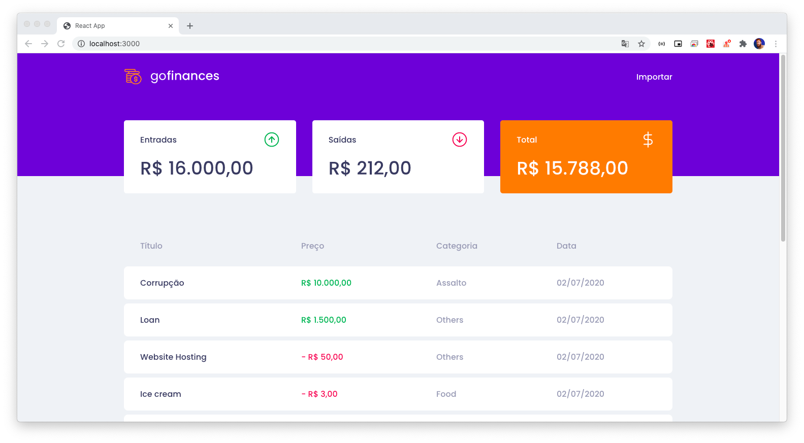

# gofinances

Aplicação ReactJS escrita em TypeScript.

Criada para estudo, a aplicação simula um gerenciador financeiro, onde são lidas informações de
movimentação financeira inseridas em um banco de dados.
Funcionalidade de importar um arquivo .csv com múltiplas movimentações também foi implementada.
